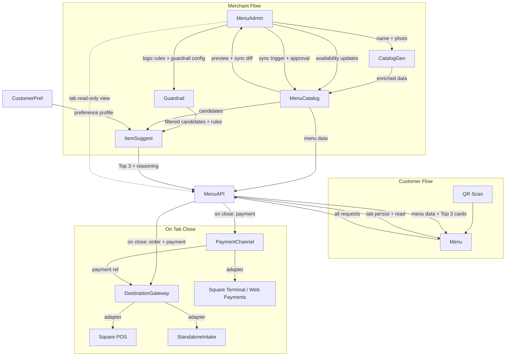

# PRD: suggestorder.com

## Overview

**Product**: AI-assisted mobile order UI
**Domain**: suggestorder.com
**Status**: Pre-implementation
**Date**: 2026-05-29 (revised)

---

## Problem

Customers at mobile-order-enabled stores arrive with uncertain purchase intent. Existing UIs (menu lists, search) require the customer to already know what they want. Ambiguity → abandonment or suboptimal orders.

**Core problem**: Undecided intent → no conversion.

---

## Solution

A single-screen mobile order UI that converts ambiguous intent into a concrete order in ≤3 taps, guided by AI-ranked suggestions.

**Positioning**: Not a chatbot. Not a search UI. A **decision-compression UI + order system**.

---

## Target

| Segment | Support level | Notes |
|---------|--------------|-------|
| A: Mobile-order stores (full integration) | Primary | Send orders to existing POS / payment system |
| B: Stores wanting to start small (menu only, or menu + standalone intake) | Primary | Adopt incrementally without POS integration |
| C: Non-mobile-order, non-digital stores | Out of scope | — |

The product supports a **gradient of adoption**, from "intelligent menu display only" to "full POS + payment integration".

---

## Hierarchy

```
org                        organization / legal entity (signup subject)
 └─ store                  physical store (1:1 with Square Location when integrated)
     └─ entry              QR location (table, counter, takeout window)
         └─ session        customer session (one customer = one session)
             └─ tab        cart instance (open or closed)
                 └─ items
```

- **org**: 1 org per signup. Owns authentication, billing, destination credentials.
- **store**: physical operation unit. Owns Catalog, Destination config, payment device config.
- **entry**: QR-addressable location within a store. 1 entry = 1 QR. Carries physical context (label like "Table 5") and **per-entry mode** (see Feature Pyramid).
- **session**: anonymous customer session. Detailed design TBD (research in progress).
- **tab**: a cart instance. Always present when ordering. May stay open indefinitely or close immediately depending on entry mode.

---

## Feature Pyramid (per entry)

Stores enable features incrementally. The product is useful at every level.

```
┌──────────────────────────────────────────┐
│  ALWAYS INCLUDED                         │
│  ├─ Menu display                         │
│  ├─ Cart (= Tab)                         │
│  └─ AI Assistant (suggestions)           │
├──────────────────────────────────────────┤
│  PER-ENTRY MODE — choose one:            │
│  ├─ no    : tab never closes, no send    │
│  ├─ send  : confirm = close + send       │
│  └─ tab   : checkout = close + send      │
├──────────────────────────────────────────┤
│  PER-STORE — required when mode≠no:      │
│  ├─ Destination (Square POS / Standalone)│
│  └─ PaymentChannel (Web / Terminal)      │
└──────────────────────────────────────────┘
```

**Mode semantics**:

| Mode | Tab lifecycle | Destination send | Typical use |
|------|--------------|------------------|-------------|
| `no` | Never closes. Customer uses tab as a memo / decision aid | Never | Stores wanting only the menu + AI experience |
| `send` | Closes on each customer-initiated "Order" tap. New tab starts after | On every close | Cafés where each order is a discrete transaction (typical: pre-pay coffee shop) |
| `tab` | Stays open as customer adds items. Closes only on customer-initiated "Checkout" | On close (single submission) | Restaurants where customers order multiple courses over time |

Mode is configured **per entry**, so a single store can mix modes (tables in `tab`, takeout in `send`, display-only counter in `no`).

---

## UX Flow

```
QR scan → entry context loaded
   ↓
Menu (browse + AI inquiry side-track)
   ↓
Add to Tab (one or more items)
   ↓
   ├─ mode=no   : tab persists; no further action
   ├─ mode=send : "Order" tap → close → send to Destination → "送信しました"
   └─ mode=tab  : keep adding → "Checkout" tap → close → send to Destination → "送信しました"
```

**Customers never order a single item directly.** Every order goes through the Tab — even single-item orders. The Tab abstraction enables:

- Multi-item orders (essential for restaurants/cafés)
- Quantity adjustment before commit
- Last-chance review (reduces wrong-order complaints)
- AI suggestions to amend before close
- Mode-independent: same UI element, different close trigger

**Customer-side responsibility ends at "送信しました"**. No order tracking, no cancel flow on the customer side (see Cancellation & Refund).

---

## UI Principles

- **1 screen**: entire flow contained in single view
- **Tap-only**: no free-text input from users
- **Zero cognitive load**: no thinking required
- **≤3 steps** to decision
- **Latency**: ≤1 second end-to-end

---

## Input Design

### User input methods (no free text)

| Method | Example |
|--------|---------|
| Tag selection | #spicy, #cold, #light |
| Quick selection | Preset options per context |
| Situation selection | Light / Heavy, Sweet / Savory |

### Merchant input (product registration in MenuAdmin)

| Input | Required |
|-------|----------|
| Product name | Required |
| Photo | Optional |

Everything else is AI-generated. MenuAdmin is the catalog SOT — AI augments minimal merchant input into rich product data.

---

## AI Responsibilities

| Domain | Role |
|--------|------|
| Product data enrichment | Auto-complete attributes (flavor, category, tags, pairings, description) |
| Inquiry generation | Generate tags and structured choices per menu context |
| Suggestion ranking | Rank candidates → Top 3 |
| Explanation | Generate per-suggestion reasoning |
| **Destination sync (NEW)** | Compare MenuAdmin catalog vs Destination catalog; propose merges in PR style |

### Out of scope for AI

- Free-form conversation
- Order confirmation
- Business/operational decisions
- Autonomous catalog mutation (AI always proposes; merchant approves)

---

## Product Data Strategy

**Principle**: Minimize merchant input burden. **Catalog SOT lives in MenuAdmin (suggestorder side).**

```
Merchant provides: name + optional photo
AI generates:
  - Flavor profile / category
  - Short description
  - Pairing recommendations
  - Tags for inquiry matching
Merchant reviews + approves
  ↓
Stored in MenuCatalog (canonical)
  ↓
Optional: sync to Destination (PR-style, merchant-approved)
```

**Accuracy target**: 60% sufficient for v1. Iterate via feedback loop.

---

## Source of Truth (SOT)

| Concept | SOT | Notes |
|---------|-----|-------|
| Catalog | **MenuAdmin** (suggestorder) | AI-augmented. Destination is a mirror. |
| Tab (open) | **suggestorder** | Server-side, readable by merchant |
| Order (after close + send) | **Destination** | suggestorder retains a send log only |
| Customer preference logs | **suggestorder** | CustomerPref |
| Payment record | **PaymentChannel provider** (e.g., Square Payments) | suggestorder retains references |

---

## Suggestion Logic

```
User structured selections
  ↓
Candidate product extraction (filter by tags/attributes, Guardrail suppresses unavailable)
  ↓
AI ranking → Top 3
  ↓
Reason generation per candidate
  ↓
Display as product cards
```

---

## Output UI: Product Card (max 3)

Each card contains:
- Product image
- Short description (1–2 lines)
- Recommendation reason (AI-generated, specific to user's selections)
- Price
- "Add to Tab" CTA

---

## Catalog Sync (PR Style)

Catalog is synchronized between MenuAdmin and connected Destinations via a **GitHub-PR-style flow**:

```
MenuAdmin (SOT)         Destination (mirror)
     │                         │
     │── merchant: trigger sync (push / pull)
     │                         │
     │── AI: diff items 1:1, classify each
     │       (new / modified / conflict / deleted)
     │
     │── present as PR to merchant
     │       (approve / reject / edit per item)
     │
     │── merge approved items → both sides updated
```

- Triggers: **manual only** (no auto-sync, no webhook-driven sync)
- Granularity: **per item** (each catalog item is independently approve/reject-able)
- Direction: **bidirectional** (push and pull both go through PR review)
- AI proposes; merchant decides

**Out-of-stock during open tab**: handled by merchant verbally (real-world restaurant pattern). No real-time notification to customer.

---

## Cancellation & Refund

- **Menu is not responsible** for cancel or refund.
- Cancel/refund happens at the Destination (Square POS, etc.) or PaymentChannel provider.
- Store reconciles records later (via Destination's own tooling).

This keeps the customer-facing flow tap-free of complex post-order states.

---

## Data Strategy

**Primary asset**: Intent decision logs (not search logs).

| Data collected | Purpose |
|---------------|---------|
| Selection history | Preference modeling |
| Preference trends | Personalization |
| Context (time, entry, party size) | Contextual ranking |
| Tab close outcome (sent / not) | Conversion signal |

These logs represent **decision-making patterns**, not browse patterns. Long-term moat.

---

## Services

### Menu
Customer-facing UI service. Owns the full UX flow from QR scan to "送信しました".

**Responsibilities**:
- Load entry context from QR
- Render menu items (product cards, images, prices)
- Present structured inquiry UI (tag/situation/quick selection)
- Display AI suggestion cards (max 3) with reasoning
- Maintain the Tab (server-side persisted, mode-aware)
- Trigger Tab close per entry mode
- Submit closed Tab via DestinationGateway

**Single backend dependency**: MenuAPI only.

**Does not**: handle payment directly (delegates to PaymentChannel via MenuAPI), manage post-send order state, manage cancel/refund.

---

### MenuAdmin
Merchant-facing admin UI. Owns product registration, catalog management, **suggestion tuning**, and **destination configuration**.

This is a core value surface — merchants control both their catalog and how AI suggestions behave for their business context.

**Responsibilities**:

_Catalog management (SOT)_
- Accept merchant product input (name + optional photo upload)
- Trigger CatalogGen enrichment on submit
- Display enrichment preview for merchant review/correction
- Manage product availability (active/inactive, sold out)

_Catalog sync (PR style)_
- Trigger push/pull sync with connected Destinations
- Present AI-generated diff as PR
- Approve/reject/edit per item, merge on approval

_Suggestion configuration (core value)_
- Boost specific products in ranking (high-margin, seasonal, inventory clearance)
- Suppress specific products or combinations from suggestions
- Pin campaign/featured items into suggestion slots
- Define store-specific recommendation axes
- Set inquiry option weights per store context

_Store / entry settings_
- Define entries (QR locations) and their per-entry mode (`no`/`send`/`tab`)
- Select Destination per store (Square POS / Standalone / none)
- Select PaymentChannel per store (Web / Terminal / none)
- Pair payment terminal devices (when applicable)

_Tab visibility (read-only)_
- View live tab contents per session (merchant cannot modify, cancel, or close — view only)

**Does not**: handle customer flow, serve orders directly, run AI enrichment internally (delegates to CatalogGen).

---

### MenuCatalog
Catalog read/write API. Owns the enriched product data store. SOT for catalog within suggestorder.

**Responsibilities**:
- Persist enriched product data written by CatalogGen and MenuAdmin
- Maintain mapping table `internal_item_id ↔ destination_external_id` per destination
- Serve product catalog to Menu (customer flow, read-only)
- Serve catalog state to MenuAdmin (availability, enrichment status, sync diff)
- Apply availability updates from MenuAdmin
- Expose filtered catalog queries (by tag, category, availability)

**Does not**: enrich data, rank suggestions, serve UI, sync with destinations autonomously.

---

### CatalogGen
AI-powered product data enrichment service. Runs at merchant onboarding and on-demand.

**Responsibilities**:
- Accept merchant input (product name + optional photo)
- Generate: flavor profile, category, short description, pairing recommendations, tags
- Generate sync diff proposals (compare MenuAdmin item vs Destination item, propose merge)
- Generate localized variants (per-locale catalog enrichment)

**Accuracy target**: 60% v1 — prioritize coverage over precision. Feedback loop improves over time.

**Does not**: serve suggestions at request time (catalog is pre-generated, not real-time), persist data (delegates to MenuCatalog).

---

### MenuAPI
Core backend API. Orchestrates suggestion generation and serves as the single endpoint for the customer-facing flow.

**Responsibilities**:
- Receive user intent signals (structured selections) from Menu
- Fetch candidate products from MenuCatalog (filtered by tags/attributes)
- Fetch preference profile from CustomerPref
- Apply merchant logic rules and guardrails from MenuAdmin config
- Run AI ranking → Top 3 candidates with reasoning (via ItemSuggest)
- Return suggestion payload to Menu within ≤1s SLA
- Persist tab state per session
- Trigger DestinationGateway + PaymentChannel on tab close
- Write intent signals and outcomes back to CustomerPref

MenuAPI is the orchestration layer. Suggestion logic itself is delegated to ItemSuggest.

**Does not**: own data stores, serve UI, talk to destinations directly (delegates to DestinationGateway), handle payment directly (delegates to PaymentChannel).

---

### Guardrail
Suppress layer. Removes candidates that violate merchant-defined constraints before ranking runs. ItemSuggest never sees suppressed items.

**Responsibilities**:
- Receive suppress config from MenuAdmin (out-of-stock, allergen conflicts, off-brand combos, explicit exclusions)
- Filter candidate product list — remove violating items
- Pass cleaned candidate set to ItemSuggest

**Does not**: boost, rank, or reason — suppress only.

---

### ItemSuggest
AI suggestion engine. Owns boost, ranking, and reasoning generation.

**Responsibilities**:
- Receive filtered candidate list from Guardrail + preference profile from CustomerPref
- Apply merchant boost weights (pinned items, campaign products, high-margin priority)
- Run AI ranking → Top 3
- Generate per-item recommendation reasoning (specific to user's selections)
- Return ranked suggestion payload to MenuAPI

**Does not**: suppress candidates — Guardrail owns that.

---

### DestinationGateway _(was POSConnector)_
Adapter layer for outbound order routing.

**Responsibilities**:
- Accept closed Tab from MenuAPI
- Resolve which Destination adapter to invoke (per store config)
- Translate closed Tab → Destination-specific payload (each adapter owns its schema)
- Submit to Destination
- Persist a send log (timestamp, destination, response/error)
- Return send result to MenuAPI

**Adapters (MVP)**:
- `SquarePOSAdapter` — pushes via Square Orders API (`CreateOrder` + `PayOrder`)
- `StandaloneIntakeAdapter` — persists to internal intake store, notifies merchant intake UI

**Does not**: own order state after submission (SOT shifts to Destination), handle payment, manage refunds.

---

### PaymentChannel _(new abstraction)_
Adapter layer for payment processing.

**Responsibilities**:
- Initiate payment per store's selected channel
- Receive completion (webhook for Terminal, synchronous for Web)
- Provide payment reference to DestinationGateway for inclusion in destination payload

**Adapters (MVP)**:
- `WebPaymentsAdapter` — Square Web Payments SDK + Payments API (customer pays on their phone)
- `TerminalAdapter` — Square Terminal API (customer pays at a physical Square terminal)

**Does not**: route orders, decide what's purchased, handle refunds (refund flow is destination-side).

---

### StandaloneIntake _(new)_
Merchant-facing order intake UI, used when `Destination = Standalone`.

**Responsibilities**:
- Display incoming orders (audio + visual notification)
- Maintain order status: accepted → preparing → ready → handed
- Show order context (entry label like "Table 5", line items, AI tags used)
- Persist orders locally (offline-tolerant via DB buffer)
- Provide daily reconciliation export (CSV)

**Does not**: push orders to other systems, handle payment, manage catalog.

---

### CustomerPref
Intent and preference data store. Accumulates decision logs across sessions.

**Write timing**: after ItemSuggest returns — logs what was shown and what the user did next. Also writes on tab close (sent / not).

**Responsibilities**:
- Receive and persist intent + suggestion logs from MenuAPI (post-suggest)
- Record tab close outcomes (sent to destination, which items, total)
- Track contextual signals (time, entry context, repeat session)
- Accumulate decision logs for future preference modeling

**Does not**: inform suggestion ranking in real-time (v1). Pure append log.

---

### Service Interaction Map



---

## Configuration Model

### org level
- Authentication credentials (incl. Square OAuth tokens)
- Billing
- (Future) shared catalog across stores

### store level
- Destination type: `square_pos` | `standalone` | `none`
- PaymentChannel type: `web` | `terminal` | `none`
- Terminal device pairing (when `terminal`)
- Standalone intake endpoint (when `standalone`)
- Square Location ID (when destination=square_pos)

### entry level
- QR slug
- Label ("Table 5", "Takeout")
- Mode: `no` | `send` | `tab`
- (Future) routing override to specific payment/intake device

### session level
- See `docs/session-design-research.md` (in progress)
- 実装方針は下記 `## Session Implementation` を参照

---

## Session Implementation

**Decision**: セッション層は **自前実装** で構築する。商用 identity SDK / OSS セッションライブラリは採用しない。

### 採用しない選択肢

| 選択肢 | 不採用理由 |
|---|---|
| **商用 SDK** (Auth0 / Clerk / Supabase Auth) | アカウント前提の identity プラットフォーム。v1 はログインを明示的に却下 (`session-design-research.md` Q6) しており、≤3 タップ UX と方向性が逆。MAU 課金モデルも QR scan ベースのユースケースに不経済。 |
| **OSS: lucia-auth** | 2025-03 に sunset 宣言済み。新規採用不可。 |
| **OSS: NextAuth / Auth.js** | アカウント前提の重量級。プロバイダ抽象が無駄になる。匿名 cookie セッションには過剰。 |
| **OSS: iron-session** | cookie 内封印 (sealed payload) 型。本設計は DB バックの opaque ID 方式 (`session-design-research.md` Q2) なので方向違い。標準 `crypto` + Next.js `cookies()` で代替可能。 |
| **二言語アーキ要因** | Next.js (TS) フロント + FastAPI (Python) API の構成のため、Node 系 OSS は Next.js 側のクッキー操作しか解決しない。Python 側の lazy persistence / `(so_sid, entry_id)` lookup / sliding 更新 / tab 連携は結局自前実装が必要。 |

### 自前実装の範囲

| レイヤ | 内容 | 想定行数 |
|---|---|---|
| **Next.js** (`apps/web/lib/session.ts`) | `cookies()` (next/headers) で `so_sid` read/set、`crypto.randomBytes(16).toString('base64url')` で生成、`HttpOnly; Secure; SameSite=Lax; Max-Age=86400`、Server Components / Route Handler 兼用ヘルパー | ~50 |
| **FastAPI** (`apps/api/sessions/`) | `Cookie` dependency で `so_sid` 受領、`Session` テーブルを `(id, entry_id)` で SELECT、stateful action 時のみ INSERT (lazy persistence)、`last_activity_at` 更新 (sliding)、tab mode 用の open check 検索 | ~100 |
| **クリーンアップ** | 24h 経過行のソフト削除を既存バッチ/cron に追加 | ~20 |

### 既存利用資産

- `apps/api/db/models.py` の `Session` / `Tab` / `TabItem` / `SuggestionLog` モデル (research doc 設計と一致 → そのまま使用)
- 標準ライブラリ: TS `crypto`、Python `secrets`
- `redis[asyncio]` (sliding TTL / レートリミットに流用可)
- 追加依存パッケージはゼロ

### 採用理由サマリ

| 観点 | 評価 |
|---|---|
| コード量 | 150〜200 行で全要件カバー |
| 依存追加 | ゼロ |
| 二言語アーキ整合性 | 自前なら Next.js / FastAPI 両側を一貫設計可能 |
| APPI / GDPR 監査 | 自前のほうが「何をどこでログしているか」が透明 |
| AI 文脈ログ統合 | `Session.context` JSONB に直書きする想定があり ORM 直接アクセスが前提 |
| 仕様カスタム度 | `(so_sid, entry_id)` キー / mode 別挙動 / tab 連携 / リスキャン rehydrate は既存 OSS に該当機能なし |
| 将来の identity 追加 | `Session` スキーマに nullable `customer_id` を持つ前提なので、後付け可能 |

### 将来の見直しトリガー

以下のいずれかが現実になったら採用方針を再評価:

- **LINE / Google ログインを v2 で本格導入**: Auth.js / Clerk を「ログイン部分のみ」併用検討。匿名 `so_sid` セッションは併存。
- **管理画面のマルチテナント SaaS 化**: MenuAdmin 側で Clerk / Auth0 採用検討。顧客側 (Menu) は自前のまま。
- **Edge Runtime への移行 + 完全 stateless 化**: iron-session 方式 (cookie 内 sealed payload) への移行検討。

---

## Performance Requirements

| Metric | Requirement |
|--------|------------|
| Initial render | Instant (cached) |
| Suggestion update | Async (non-blocking) |
| Full flow latency | ≤1 second |
| Tab persistence write | ≤200ms perceived |
| Destination send | Best-effort, with retry on transient failure |

---

## Internationalization (i18n)

**Multi-language support is a hard requirement** — design must accommodate it from day one. MVP ships Japanese-only, but no architectural shortcuts that block future locales.

### MVP scope
- UI language: 日本語のみ
- Customer-facing strings: hardcoded JA acceptable for v1
- Product data (name, description, tags): stored as-is from merchant input

### Post-MVP requirements (must not be blocked by MVP design)
- Browser/QR-parameter-based locale detection (`?lang=en`, `Accept-Language` header)
- UI string externalization (`next-intl` or equivalent)
- AI-generated content (descriptions, reasons, tags) per locale
- Product data with per-locale variants (name_ja / name_en / name_zh)

### Design implications for MVP

| Layer | Decision |
|-------|----------|
| DB schema | Product fields stay as scalar text in v1. Migration path: `name` → `name_translations: jsonb` later |
| API contract | Include `locale` param in suggest/catalog endpoints from v1 (default `ja`, ignored for now) |
| LLM prompts | Accept locale parameter, hardcode `ja` for MVP but pass through the layer |
| Frontend strings | Centralize in a single dictionary file even if JA-only, to ease later extraction |
| MenuAdmin input | Merchant inputs in their primary language; AI translates to other locales on demand |

---

## Scope Constraints

- **Industry-agnostic**: generic design, not restaurant-specific
- **Scale-agnostic**: works for 10 items or 1000 items
- **Intent-pattern-agnostic**: inquiry options are AI-generated per menu, not hardcoded
- **Adoption-gradient-aware**: useful at every level of the Feature Pyramid

---

## Out of Scope (v1)

- Real-time customer notification of catalog changes (handled verbally by merchant)
- Cancel / refund flows on the customer side (handled at Destination)
- Tab merging / splitting across sessions
- Multi-entry routing rules (1 payment + 1 intake device per store in v1)
- Group ordering (multiple customers sharing a tab) — pending session design
- CRM / loyalty systems
- Auto-sync (Catalog sync is always manual in v1)
- Real-time tab live-validation against catalog changes (validated at send time only)

---

## Success Metrics

| Metric | Definition |
|--------|-----------|
| Conversion rate | % of QR scans → tab close with send |
| Decision time | Time from menu display to first "Add to Tab" |
| Suggestion acceptance rate | % of AI suggestions added to tab |
| Tab close rate | % of opened tabs that close (send mode) |
| Merchant onboarding time | Time from signup to first live QR |

---

## Next Steps (implementation order)

1. **Finalize session design** (research running — see `docs/session-design-research.md`)
2. **Destination payload schemas** (research running — see `docs/destination-payload-schemas.md`)
3. Customer / merchant sequence diagrams per quadrant × mode (see `docs/flows.md`)
4. Screen wireframe (single-screen composition, mode-aware)
5. Data schema (org / store / entry / session / tab / items / sync_state)
6. Suggestion logic implementation (ranking algorithm)
7. Merchant onboarding flow (product registration + AI enrichment + destination wizard)
8. API design (suggestion endpoint ≤1s SLA, tab close endpoint, sync trigger endpoint)
9. DestinationGateway: Standalone adapter (Phase 1)
10. PaymentChannel: Web Payments adapter (Phase 1)
11. DestinationGateway: Square POS adapter (Phase 2)
12. PaymentChannel: Terminal adapter (Phase 2)
