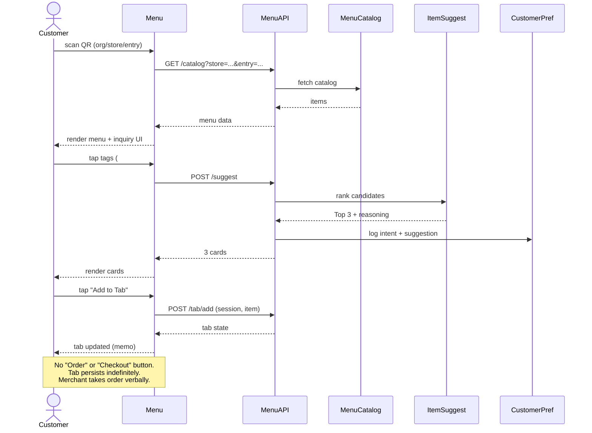
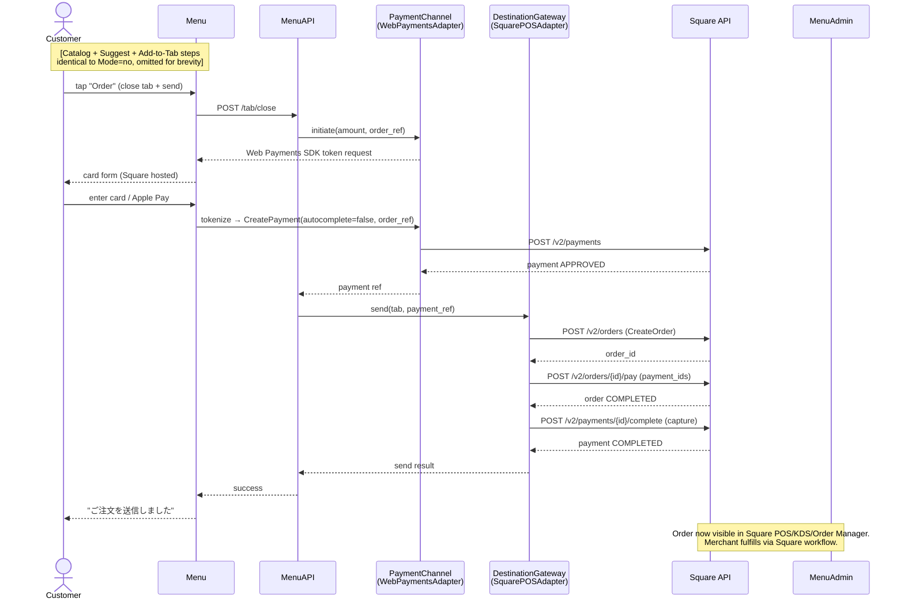
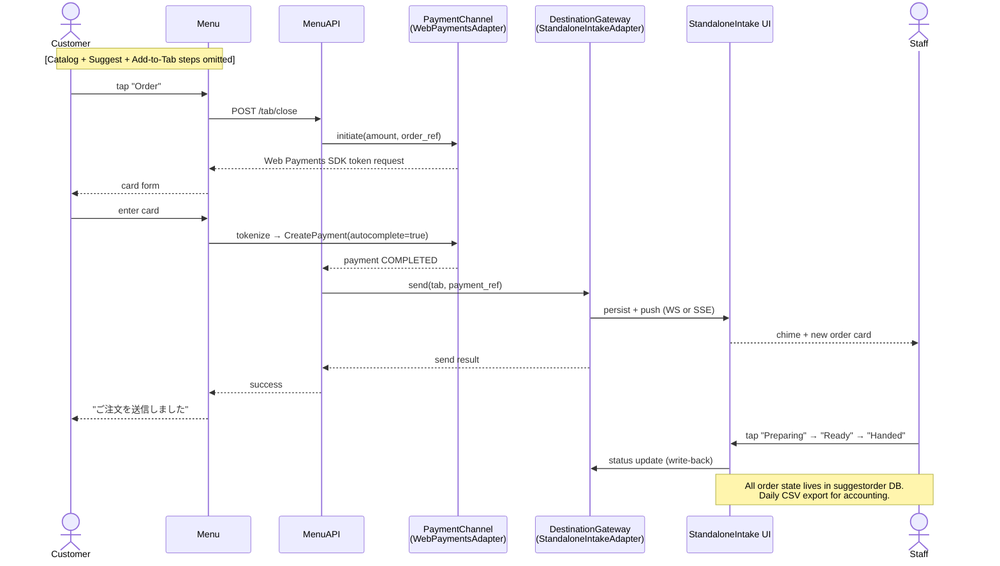
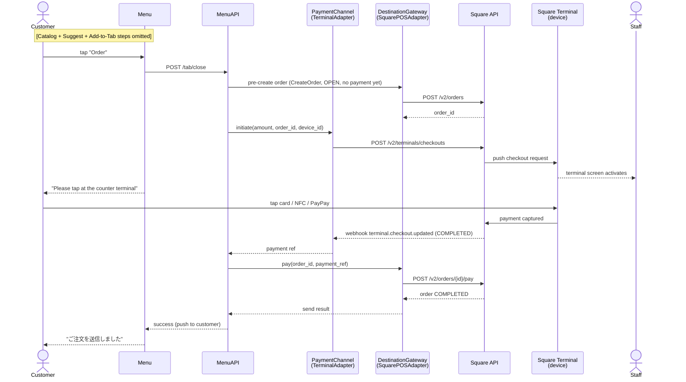
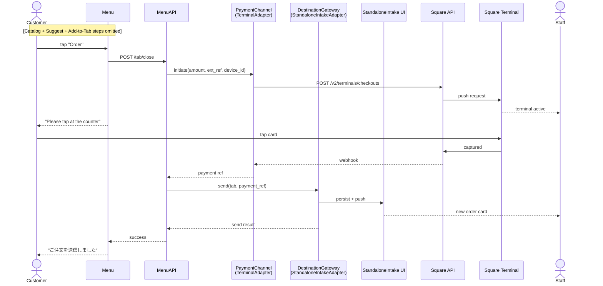
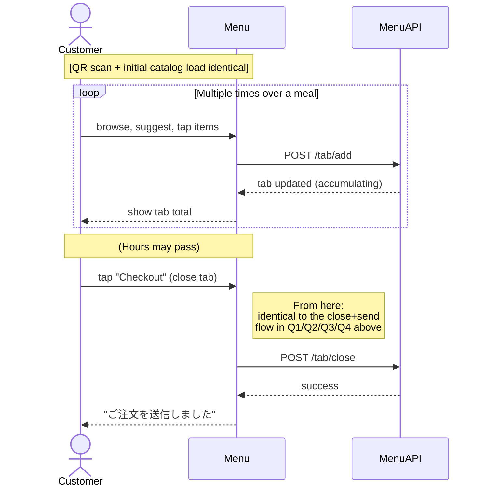
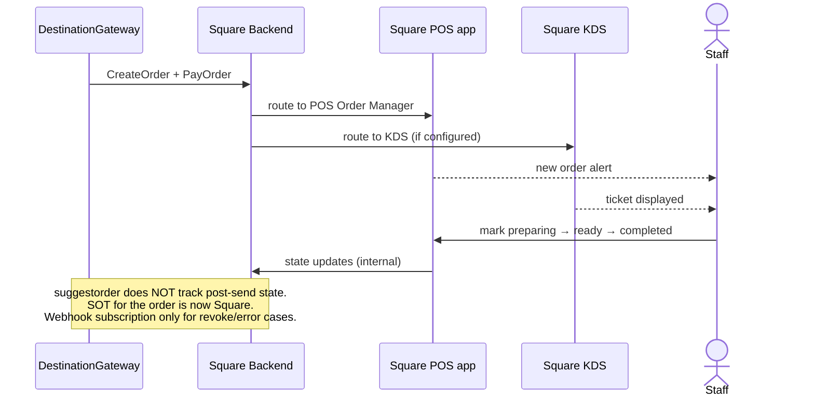
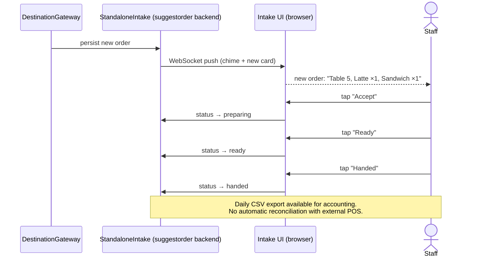
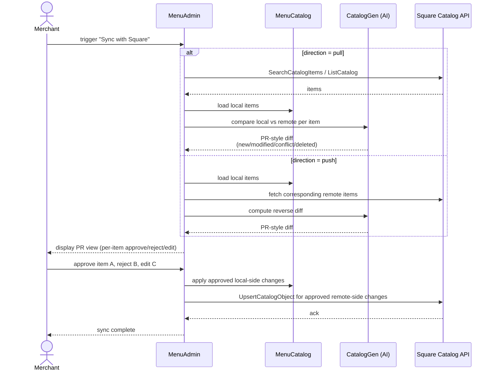

# Suggestorder Flows: Customer × Merchant × Configuration

**Date**: 2026-05-29
**Status**: Design draft
**Scope**: Sequence diagrams for all configuration combinations defined in PRD

This document expands the high-level UX flow in `PRD.md` into concrete sequence diagrams for each combination of:

- **Mode** (per entry): `no` / `send` / `tab`
- **Destination** (per store): `SquarePOS` / `StandaloneIntake`
- **PaymentChannel** (per store): `Web` / `Terminal`

The customer-facing flow is largely identical across combinations; the merchant-facing flow diverges most.

---

## 0. Configuration Matrix

```
                                      Destination
                              ┌──────────┬────────────┐
                              │ SquarePOS│ Standalone │
       PaymentChannel ┌───────┼──────────┼────────────┤
                      │  Web  │   Q1     │    Q2      │
                      │Terminal│   Q3    │    Q4      │
                      └───────┴──────────┴────────────┘

  Mode (per entry):
    no    — applies regardless of destination/payment (no send)
    send  — close triggered per customer "Order" tap
    tab   — close triggered per customer "Checkout" tap
```

| Combination | Use case |
|-------------|---------|
| no | Stores using suggestorder as a smart menu display |
| send + Q1 | Café with Square POS and online customer payment |
| send + Q2 | Café without Square POS; uses StandaloneIntake + customer pays online |
| send + Q3 | Café with Square POS and customer pays at counter terminal |
| send + Q4 | Café without Square POS; customer pays at counter terminal |
| tab + Q1..Q4 | Same as send variants, but customer accumulates over time |

---

## 1. Mode = `no` (no destination, no payment)

Pure menu + AI suggestion. Tab persists but never closes.



---

## 2. Mode = `send`, **Q1** (Web Payments + Square POS)

Customer pays on their phone, order pushes to Square POS.



---

## 3. Mode = `send`, **Q2** (Web Payments + Standalone)

Customer pays on their phone, order shows on merchant's StandaloneIntake screen.



---

## 4. Mode = `send`, **Q3** (Terminal + Square POS)

Customer scans QR, builds tab, then completes payment at the counter Square Terminal.



---

## 5. Mode = `send`, **Q4** (Terminal + Standalone)

Niche combo. Customer pays at Square Terminal but order intake is suggestorder's own UI.



---

## 6. Mode = `tab` (any quadrant)

`tab` mode is identical to `send` mode in **destination/payment flows**. The only difference is the **close trigger**: instead of every "Order" tap, the customer presses "Checkout" once at the end.



**Key differences in `tab` mode**:
- Tab close trigger is one-shot ("Checkout"), not per item batch
- Tab state may persist for hours
- Merchant can view tab contents read-only while open
- Out-of-stock items added earlier are validated only at close time

---

## 7. Merchant Flow: Square POS Destination

Once `DestinationGateway → SquarePOSAdapter` completes, the order is in Square's hands.



---

## 8. Merchant Flow: Standalone Intake Destination



---

## 9. Catalog Sync (PR-style, merchant-triggered)



---

## 10. Edge Cases (informal)

### Out-of-stock during tab open
1. Merchant marks item sold-out in MenuAdmin (or destination triggers update)
2. Tab UI does NOT auto-refresh (per design — no live notification)
3. On `/tab/close`, server validates each item against current catalog
4. If any item is sold-out: send fails, return validation error to customer
5. Customer removes item, retries
6. Real-world fallback: merchant verbally informs at fulfillment ("申し訳ありません、品切れです")

### Destination unreachable on close
1. Tab close attempted
2. DestinationGateway returns transient failure
3. MenuAPI retries with backoff (3 attempts)
4. On final failure:
   - If payment already captured: queue for retry, alert merchant via internal dashboard
   - If payment not captured: void payment, show error to customer ("ネットワークエラー、もう一度お試しください")

### Customer reloads mid-tab (mode=tab)
- Pending session design (see `docs/session-design-research.md`)

### Multiple customers at same entry
- Pending session design

### Tab open for days (mode=tab abandoned)
- Per PRD: no timeout, no cleanup. Tab persists.
- merchant can manually mark "abandoned" via MenuAdmin (read-only view + soft-archive)

---

## 11. Notes for Implementation Planning

- **Phase 1 (highest coverage / lowest risk)**: Mode=no + Mode=send Q2 (Web Payments + Standalone). This combo has zero Square Orders/Catalog API dependencies.
- **Phase 2**: Mode=send Q1 (Web Payments + Square POS). Requires Square Orders + Catalog API.
- **Phase 3**: Mode=send Q3/Q4 (Terminal). Requires Terminal API + device pairing.
- **Phase 4**: Mode=tab across all quadrants. Same destination/payment logic; UI difference only.

Each phase ships independently — merchants on later phases can adopt earlier-phase features today.
